# BOM Upload Enhanced - Documentation

File: `clevertech/doctype/bom_upload/bom_upload_enhanced.py`

---

## Part 1: Technical Flowchart (Developer Reference)

### 1.1 Main Entry Point: `create_boms_with_validation()` (Line 192)

```mermaid
flowchart TB
    subgraph Entry["Entry Point: create_boms_with_validation(docname)"]
        A[Start] --> A1[frappe.get_doc 'BOM Upload', docname]
        A1 --> V1{doc.bom_file?}
        V1 -->|No| E1[❌ frappe.throw<br/>'Please attach a BOM Excel file first']
        V1 -->|Yes| V2{doc.project?}
        V2 -->|No| E2[❌ frappe.throw<br/>'Please select a Project first']
        V2 -->|Yes| V3{doc.machine_code?}
        V3 -->|No| E3[❌ frappe.throw<br/>'Machine Code is required']
        V3 -->|Yes| LOAD
    end

    subgraph LOAD["Load Excel File"]
        L1[frappe.get_doc 'File', file_url] --> L2[file_doc.get_content]
        L2 --> L3[openpyxl.load_workbook<br/>io.BytesIO, data_only=True]
        L3 --> L4[ws = wb.active]
        L4 --> L5{HAS_IMAGE_LOADER?}
        L5 -->|Yes| L6[image_loader = SheetImageLoader ws]
        L5 -->|No| L7[image_loader = None]
        L6 --> PARSE
        L7 --> PARSE
    end

    subgraph PARSE["Step 1: Parse Excel (Line 231)"]
        P1[parse_rows_dynamic ws] --> P2[build_tree rows]
        P2 --> P3{tree empty?}
        P3 -->|Yes| E4[❌ frappe.throw<br/>'No components found']
        P3 -->|No| ITEMS
    end

    subgraph ITEMS["Step 2: Create Items (Line 239)"]
        I1[item_counters = dict<br/>created, existing, updated, failed] --> I2[ensure_items_for_all_nodes<br/>tree, ws, image_loader, counters]
        I2 --> CM
    end

    subgraph CM["Step 3: Create Component Masters (Line 245)"]
        C1[cm_counters = create_component_masters_for_all_items<br/>tree, project, machine_code] --> ANALYZE
    end

    subgraph ANALYZE["Step 4: Analyze Upload (Line 248)"]
        AN1[analysis = analyze_upload<br/>tree, project, machine_code] --> BLOCK
    end

    subgraph BLOCK["Step 5: Blocking Checks (Line 251-324)"]
        B1{analysis.loose_blocked?} -->|Yes| R1[Return status: 'blocked'<br/>reason: 'loose_items_not_enabled']
        B1 -->|No| B2{analysis.changed_components?}
        B2 -->|No| CREATE
        B2 -->|Yes| B3[Categorize by blocking_level]
        B3 --> B4[hard_blocked = block level]
        B3 --> B5[manager_blocked = manager_required + !can_proceed]
        B3 --> B6[confirmable = confirm level OR manager_required + can_proceed]
        B4 --> B7{hard_blocked not empty?}
        B7 -->|Yes| R2[Return status: 'procurement_blocked'<br/>reason: 'active_mr_rfq']
        B7 -->|No| B8{manager_blocked not empty?}
        B8 -->|Yes| R3[Return status: 'manager_required'<br/>reason: 'active_po_no_role']
        B8 -->|No| B9{confirmable not empty?}
        B9 -->|Yes| R4[Return status: 'requires_confirmation'<br/>User must confirm with remarks]
        B9 -->|No| CREATE
    end

    subgraph CREATE["Step 6 & 7: Create BOMs (Line 327)"]
        CR1[result = create_boms_and_link_components<br/>tree, project, analysis, ws, image_loader] --> CR2[Build summary dict]
        CR2 --> CR3[_build_summary_message]
        CR3 --> CR4[frappe.db.commit]
        CR4 --> CR5[Return result]
    end

    style E1 fill:#ffcccc
    style E2 fill:#ffcccc
    style E3 fill:#ffcccc
    style E4 fill:#ffcccc
    style R1 fill:#ffcccc
    style R2 fill:#ffcccc
    style R3 fill:#ffcccc
    style R4 fill:#fff3cd
    style CR5 fill:#ccffcc
```

### 1.2 Dynamic Column Mapping: `map_excel_columns()` (Line 58)

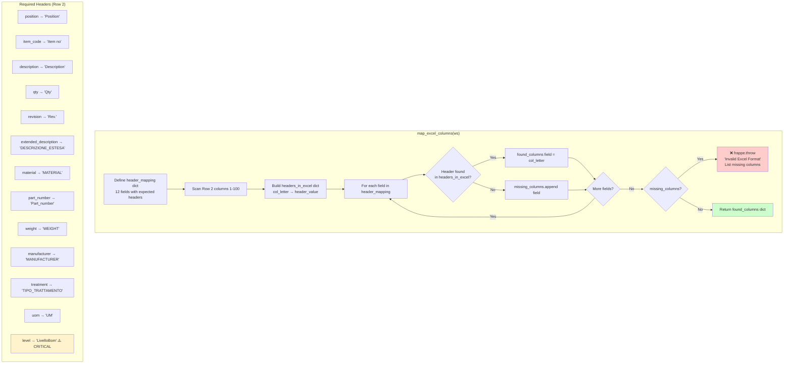

### 1.3 Parse Rows: `parse_rows_dynamic()` (Line 139)

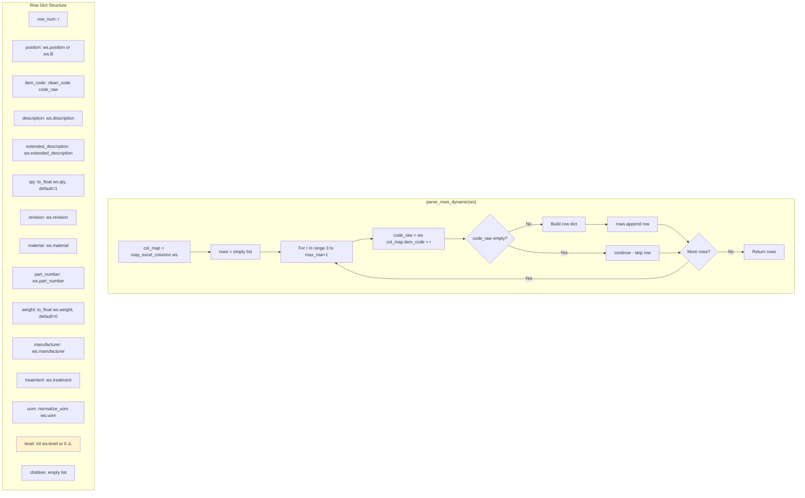

### 1.4 Create Items: `ensure_items_for_all_nodes()` (Line 367)

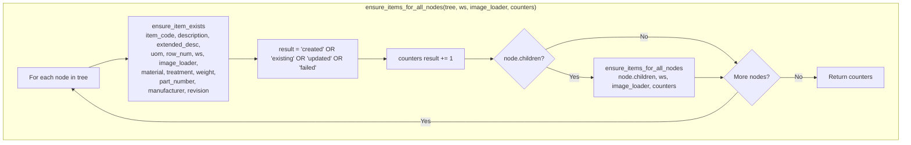

### 1.5 Create Component Masters: `create_component_masters_for_all_items()` (Line 411)

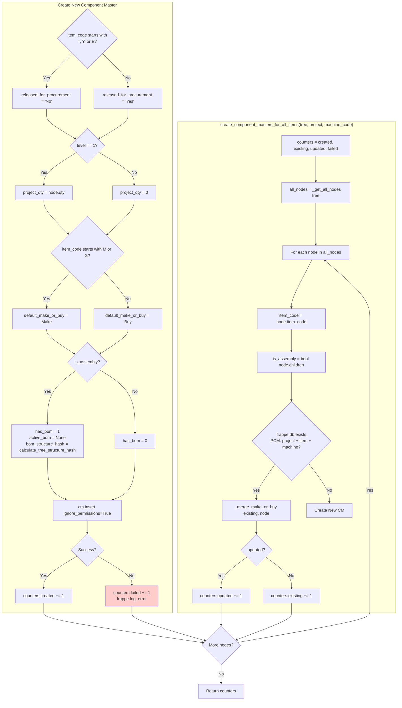

### 1.6 Analyze Upload: `analyze_upload()` (Line 568)

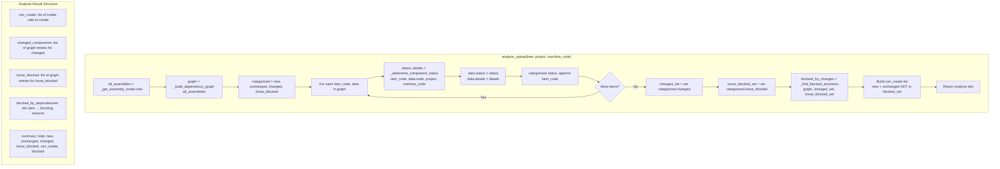

### 1.7 Determine Component Status: `_determine_component_status()` (Line 630)

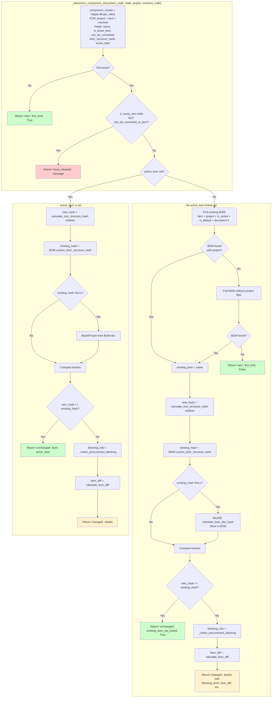

### 1.8 Check Procurement Blocking: `_check_procurement_blocking()` (Line 938)

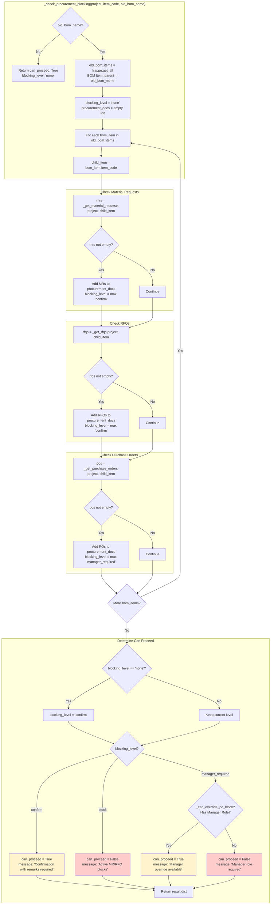

### 1.9 Confirm Version Change: `confirm_version_change()` (Line 1045)

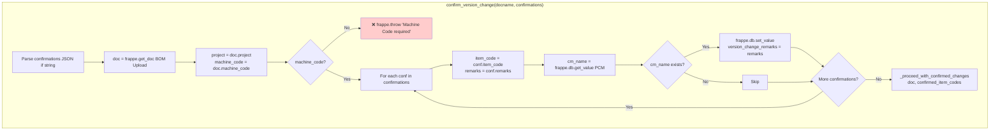

### 1.10 Proceed with Confirmed Changes: `_proceed_with_confirmed_changes()` (Line 1094)

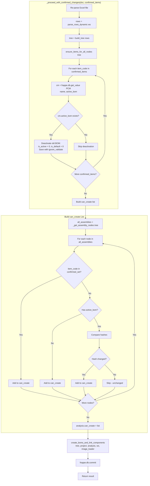

### 1.11 Create BOMs and Link: `create_boms_and_link_components()` (Line 1225)

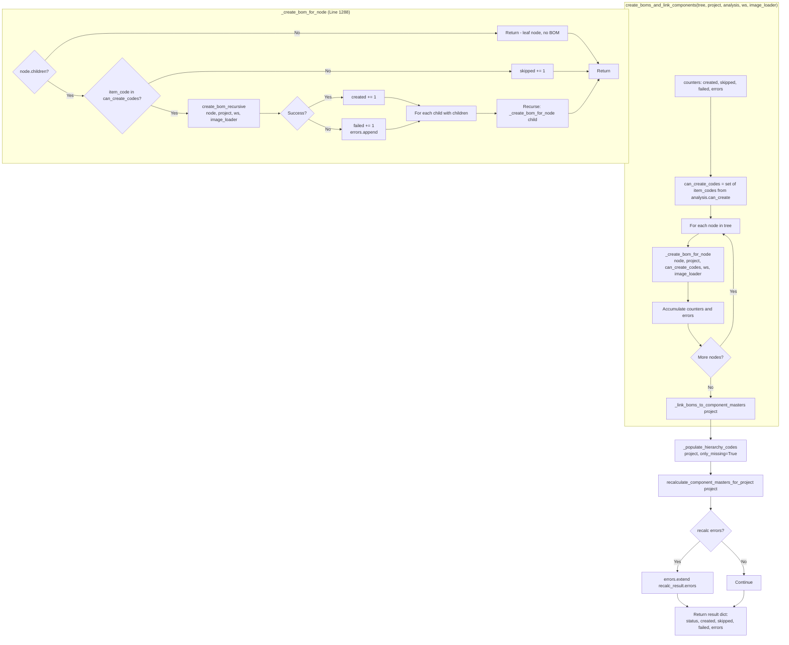

### 1.12 Link BOMs to Component Masters: `_link_boms_to_component_masters()` (Line 1340)

```mermaid
flowchart TB
    subgraph LinkBOMs["_link_boms_to_component_masters(project)"]
        L1[cms = frappe.get_all PCM<br/>project + has_bom=1<br/>Fields: name, item_code, active_bom] --> L2[linked_boms = empty list]
        L2 --> L3[For each cm_data in cms]
        L3 --> L4[Find active default BOM<br/>item + project + is_active + is_default + docstatus=1]
        L4 --> L5{BOM found with project?}
        L5 -->|No| L6[Find BOM without project filter]
        L5 -->|Yes| L7[bom_name = result]
        L6 --> L8{BOM found?}
        L8 -->|No| L9[Skip - no BOM exists]
        L8 -->|Yes| L7
        L7 --> L10{cm_data.active_bom == bom_name?}
        L10 -->|Yes| L11[Skip - already linked]
        L10 -->|No| L12[cm = frappe.get_doc PCM]
        L12 --> L13[cm.active_bom = bom_name]
        L13 --> L14[cm.bom_structure_hash = calculate_bom_doc_hash]
        L14 --> L15[cm.save ignore_permissions, ignore_validate]
        L15 --> L16[linked_boms.append bom_name, item]
        L9 --> L17{More cms?}
        L11 --> L17
        L16 --> L17
        L17 -->|Yes| L3
        L17 -->|No| L18{linked_boms not empty?}
        L18 -->|Yes| L19[populate_bom_usage_tables project, linked_boms]
        L18 -->|No| L20[Done]
        L19 --> L20
    end
```

### 1.13 Populate Hierarchy Codes: `_populate_hierarchy_codes()` (Line 1425)

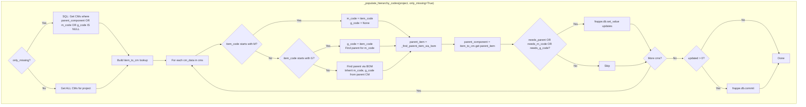

### 1.14 Hash Calculation: `calculate_tree_structure_hash()` (Line 1616)

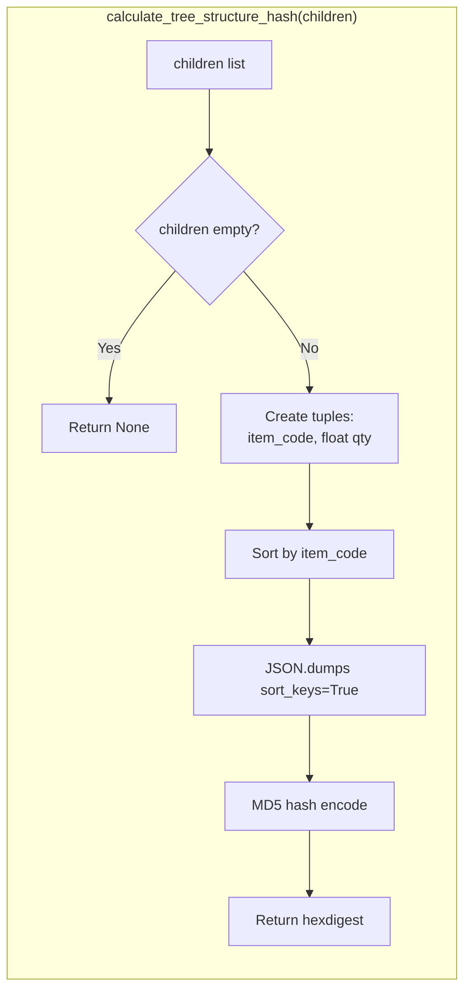

### 1.15 BOM Diff Calculation: `calculate_bom_diff()` (Line 1639)

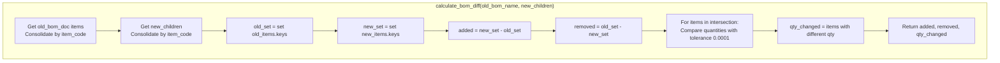

---

## Part 2: Testing Flowchart (QA Reference)

### 2.1 Test Scenarios Overview

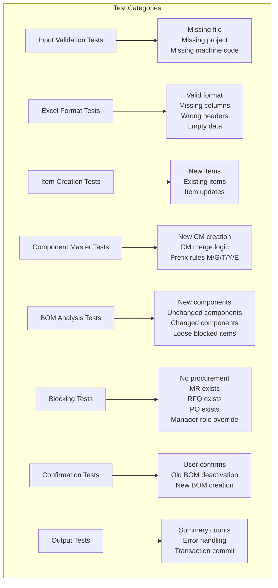

### 2.2 Input Validation Test Flow

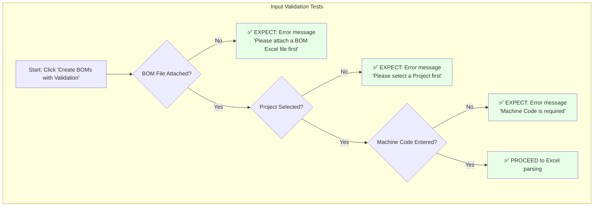

### 2.3 Excel Format Test Flow

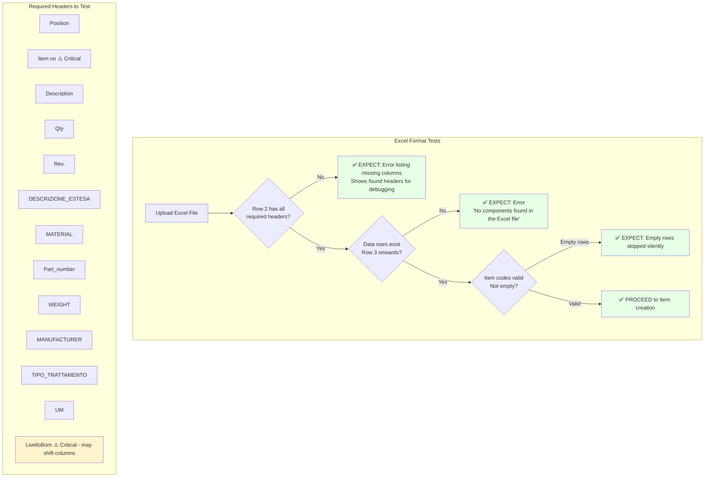

### 2.4 Component Master Creation Test Flow

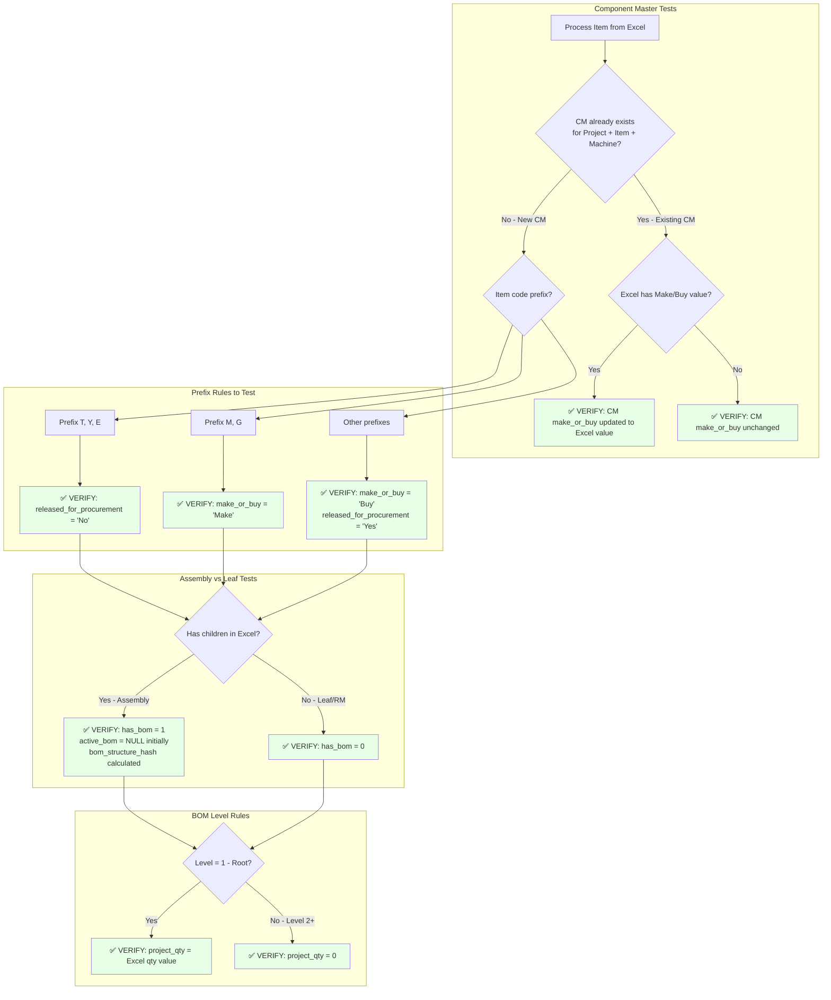

### 2.5 BOM Change Detection Test Flow

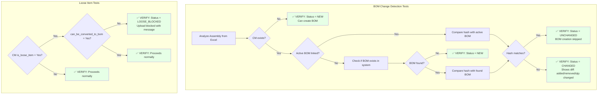

### 2.6 Procurement Blocking Test Flow

```mermaid
flowchart TB
    subgraph BlockingTests["Procurement Blocking Tests"]
        B1[Changed component detected] --> B2[Check child items of old BOM]
        B2 --> B3{Any child has<br/>Material Request?}
        B3 -->|Yes| B4[✅ VERIFY: Blocking level = 'confirm'<br/>User can proceed with remarks]
        B3 -->|No| B5{Any child has RFQ?}
        B5 -->|Yes| B6[✅ VERIFY: Blocking level = 'confirm'<br/>User can proceed with remarks]
        B5 -->|No| B7{Any child has<br/>Purchase Order?}
        B7 -->|Yes| B8{User has Manager role?}
        B8 -->|Yes| B9[✅ VERIFY: Can proceed with manager override]
        B8 -->|No| B10[✅ VERIFY: BLOCKED<br/>'Manager role required' message]
        B7 -->|No| B11[✅ VERIFY: Blocking level = 'confirm'<br/>Needs confirmation only]
    end

    subgraph ConfirmationTests["User Confirmation Tests"]
        C1[User clicks Confirm] --> C2[Enter remarks for each changed item]
        C2 --> C3[✅ VERIFY: Remarks saved to CM.version_change_remarks]
        C3 --> C4[✅ VERIFY: Old BOM deactivated<br/>is_active = 0, is_default = 0]
        C4 --> C5[✅ VERIFY: New BOM created and submitted]
        C5 --> C6[✅ VERIFY: CM.active_bom updated to new BOM]
    end

    style B4 fill:#e6ffe6
    style B6 fill:#e6ffe6
    style B9 fill:#e6ffe6
    style B10 fill:#ffe6e6
    style B11 fill:#e6ffe6
    style C3 fill:#e6ffe6
    style C4 fill:#e6ffe6
    style C5 fill:#e6ffe6
    style C6 fill:#e6ffe6
```

### 2.7 BOM Creation & Linking Test Flow

```mermaid
flowchart TB
    subgraph BOMCreationTests["BOM Creation Tests"]
        BC1[Approved for BOM creation] --> BC2{Assembly node?}
        BC2 -->|No - Leaf| BC3[✅ VERIFY: No BOM created for leaf items]
        BC2 -->|Yes| BC4{In can_create list?}
        BC4 -->|No| BC5[✅ VERIFY: BOM creation skipped]
        BC4 -->|Yes| BC6[✅ VERIFY: BOM created with:<br/>• Correct item as parent<br/>• All children as BOM items<br/>• Quantities from Excel<br/>• Project linked]
        BC6 --> BC7[✅ VERIFY: BOM submitted docstatus=1]
        BC7 --> BC8[✅ VERIFY: BOM is_active=1, is_default=1]
    end

    subgraph LinkingTests["CM Linking Tests"]
        L1[After BOM creation] --> L2[✅ VERIFY: CM.active_bom points to new BOM]
        L2 --> L3[✅ VERIFY: CM.bom_structure_hash matches BOM hash]
        L3 --> L4[✅ VERIFY: BOM Usage table populated<br/>for all child items]
    end

    subgraph HierarchyTests["Hierarchy Code Tests"]
        H1[After linking] --> H2{Item is M-code?}
        H2 -->|Yes| H3[✅ VERIFY: CM.m_code = item_code<br/>CM.g_code = NULL]
        H2 -->|No| H4{Item is G-code?}
        H4 -->|Yes| H5[✅ VERIFY: CM.g_code = item_code<br/>CM.m_code = parent's M-code]
        H4 -->|No| H6[✅ VERIFY: CM inherits m_code, g_code from parent]
        H3 --> H7[✅ VERIFY: parent_component links to parent CM]
        H5 --> H7
        H6 --> H7
    end

    subgraph RecalcTests["Quantity Recalculation Tests"]
        R1[After hierarchy populated] --> R2[✅ VERIFY: total_qty_limit calculated correctly]
        R2 --> R3[✅ VERIFY: bom_qty_required populated from BOM structure]
    end

    style BC3 fill:#e6ffe6
    style BC5 fill:#e6ffe6
    style BC6 fill:#e6ffe6
    style BC7 fill:#e6ffe6
    style BC8 fill:#e6ffe6
    style L2 fill:#e6ffe6
    style L3 fill:#e6ffe6
    style L4 fill:#e6ffe6
    style H3 fill:#e6ffe6
    style H5 fill:#e6ffe6
    style H6 fill:#e6ffe6
    style H7 fill:#e6ffe6
    style R2 fill:#e6ffe6
    style R3 fill:#e6ffe6
```

### 2.8 Output Verification Test Flow

```mermaid
flowchart TB
    subgraph OutputTests["Output Verification Tests"]
        O1[Process Complete] --> O2[✅ VERIFY: Summary shows correct counts]
        O2 --> O3[Items: created / existing / updated / failed]
        O2 --> O4[BOMs: created / existing / failed]
        O2 --> O5[Component Masters: created / existing / updated / failed]
        O3 --> O6[✅ VERIFY: Total = sum of all categories]
        O4 --> O6
        O5 --> O6
        O6 --> O7{Any failures?}
        O7 -->|Yes| O8[✅ VERIFY: Errors logged to Error Log]
        O7 -->|No| O9[✅ VERIFY: Clean completion]
        O8 --> O10[✅ VERIFY: frappe.db.commit called]
        O9 --> O10
    end

    subgraph ErrorHandling["Error Handling Tests"]
        E1[Simulate failure scenarios] --> E2[Item creation fails]
        E2 --> E3[✅ VERIFY: Failure counted, process continues]
        E1 --> E4[CM creation fails]
        E4 --> E5[✅ VERIFY: Failure logged, process continues]
        E1 --> E6[BOM creation fails]
        E6 --> E7[✅ VERIFY: Error in errors list, other BOMs still created]
    end

    style O2 fill:#e6ffe6
    style O6 fill:#e6ffe6
    style O8 fill:#e6ffe6
    style O9 fill:#e6ffe6
    style O10 fill:#e6ffe6
    style E3 fill:#e6ffe6
    style E5 fill:#e6ffe6
    style E7 fill:#e6ffe6
```

### 2.9 Test Data Checklist

| Test Scenario | Required Test Data | Expected Result |
|---------------|-------------------|-----------------|
| Valid upload - new items | Excel with new item codes, Project, Machine Code | All items, CMs, BOMs created |
| Re-upload same data | Same Excel uploaded again | Status: UNCHANGED, no new BOMs |
| Changed BOM structure | Excel with modified children | Status: CHANGED, requires confirmation |
| Missing Excel column | Excel without 'LivelloBom' header | Validation error with missing column name |
| Loose item blocking | CM with is_loose_item=1, can_be_converted=0 | Upload blocked with specific message |
| MR blocking | Child item has Material Request | Confirmation required (not hard blocked) |
| PO blocking - no role | Child item has PO, user lacks Manager role | Hard blocked, manager required |
| PO blocking - with role | Child item has PO, user has Manager role | Can proceed with confirmation |
| T-prefix item | Item code starting with 'T' | released_for_procurement = 'No' |
| M-prefix item | Item code starting with 'M' | make_or_buy = 'Make' |
| Level 1 assembly | Root assembly in Excel | project_qty = Excel qty |
| Level 2+ item | Child item in Excel | project_qty = 0 |

---

## Part 3: Quick Reference

### Return Status Codes

| Status | Reason | User Action Required |
|--------|--------|---------------------|
| `success` | - | None - upload complete |
| `blocked` | `loose_items_not_enabled` | Enable 'Can be converted to BOM' on loose items |
| `procurement_blocked` | `active_mr_rfq` | Deactivate old BOMs manually (currently not used) |
| `manager_required` | `active_po_no_role` | Contact user with Component Master Manager role |
| `requires_confirmation` | - | Confirm changes with remarks |

### Key Database Tables Affected

| Table | Operation | When |
|-------|-----------|------|
| Item | INSERT/UPDATE | Step 2 - Item creation |
| Project Component Master | INSERT/UPDATE | Step 3 - CM creation |
| BOM | INSERT | Step 6 - BOM creation |
| BOM Item | INSERT | Step 6 - BOM creation |
| Component BOM Usage | INSERT | Step 7 - populate_bom_usage_tables |
| Component BOM Version History | INSERT | On version change confirmation |
