# BOM Upload - Testing Guide

**Document Purpose:** QA Reference for testing BOM Upload with Validation feature
**Last Updated:** 2026-02-04

---

## 1. Test Categories Overview

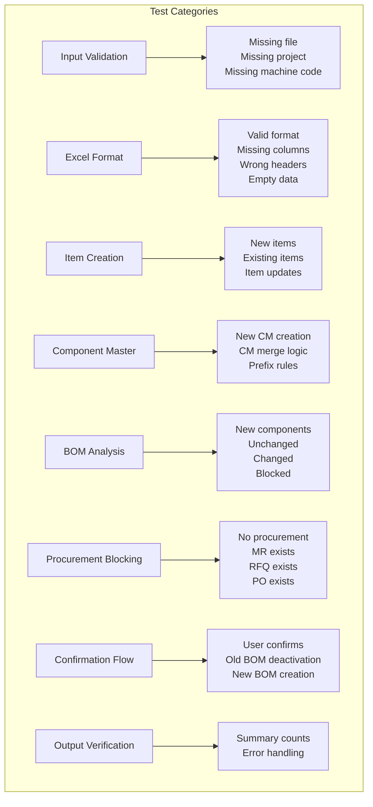

---

## 2. Input Validation Tests

### Test Flow

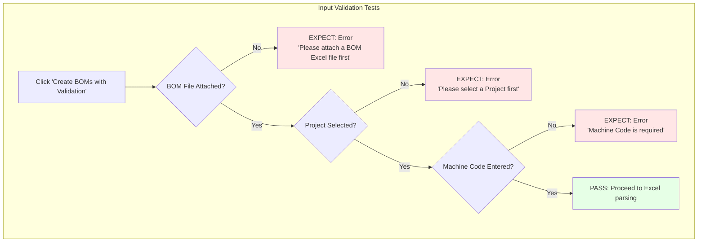

### Test Cases

| # | Test Case | Steps | Expected Result |
|---|-----------|-------|-----------------|
| 1.1 | Missing BOM file | Leave file field empty, click button | Error: "Please attach a BOM Excel file first" |
| 1.2 | Missing Project | Attach file but no project selected | Error: "Please select a Project first" |
| 1.3 | Missing Machine Code | Attach file + select project, no machine code | Error: "Machine Code is required" |
| 1.4 | All inputs valid | Provide file + project + machine code | Process continues to Excel parsing |

---

## 3. Excel Format Tests

### Test Flow

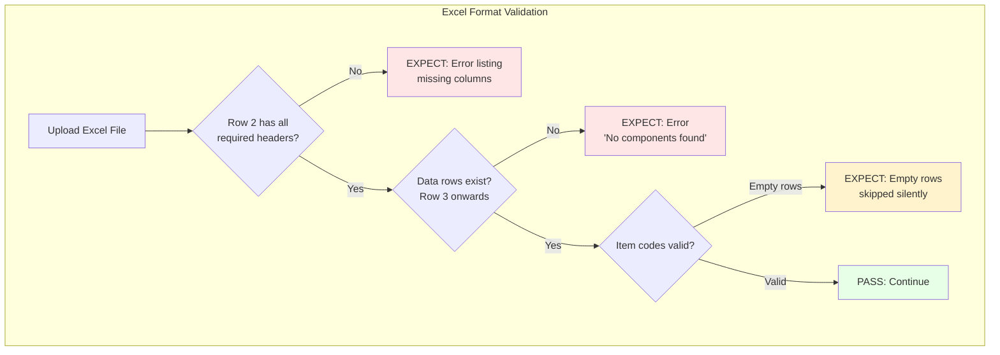

### Required Excel Headers (Row 2)

| Header Name | Field | Critical? |
|-------------|-------|-----------|
| Position | position | No |
| **Item no** | item_code | **Yes** |
| Description | description | No |
| Qty | qty | No |
| Rev. | revision | No |
| DESCRIZIONE_ESTESA | extended_description | No |
| MATERIAL | material | No |
| Part_number | part_number | No |
| WEIGHT | weight | No |
| MANUFACTURER | manufacturer | No |
| TIPO_TRATTAMENTO | treatment | No |
| UM | uom | No |
| **LivelloBom** | level | **Yes - Critical** |

### Test Cases

| # | Test Case | Steps | Expected Result |
|---|-----------|-------|-----------------|
| 3.1 | Missing header | Remove 'LivelloBom' from Row 2 | Error listing missing column |
| 3.2 | Empty data | Excel with headers only, no data rows | Error: "No components found" |
| 3.3 | Empty rows in data | Some rows have empty item codes | Empty rows skipped, valid rows processed |
| 3.4 | Valid format | All headers present with data | Process continues |

---

## 4. Component Master Tests

### Test Flow - Prefix Rules

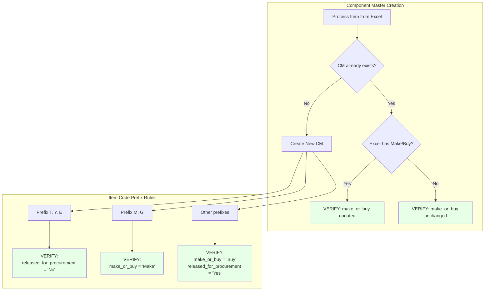

### Test Flow - Assembly vs Leaf

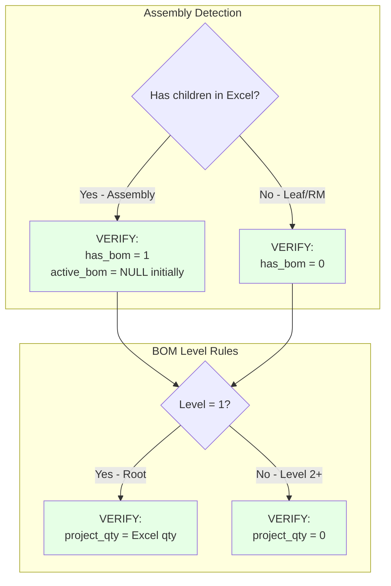

### Test Cases

| # | Test Case | Test Data | Expected Result |
|---|-----------|-----------|-----------------|
| 4.1 | T-prefix item | Item code: T12345 | released_for_procurement = 'No' |
| 4.2 | Y-prefix item | Item code: Y67890 | released_for_procurement = 'No' |
| 4.3 | E-prefix item | Item code: E11111 | released_for_procurement = 'No' |
| 4.4 | M-prefix item | Item code: M22222 | make_or_buy = 'Make' |
| 4.5 | G-prefix item | Item code: G33333 | make_or_buy = 'Make' |
| 4.6 | D-prefix item | Item code: D44444 | make_or_buy = 'Buy', released = 'Yes' |
| 4.7 | Level 1 assembly | Root item with children | project_qty = Excel qty value |
| 4.8 | Level 2 item | Child item | project_qty = 0 |
| 4.9 | Assembly node | Item with children | has_bom = 1 |
| 4.10 | Leaf node | Item without children | has_bom = 0 |

---

## 5. BOM Change Detection Tests

### Test Flow

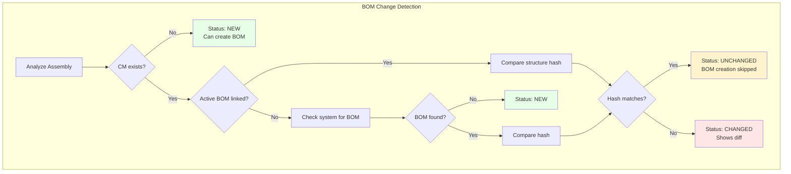

### Test Flow - Loose Item Blocking

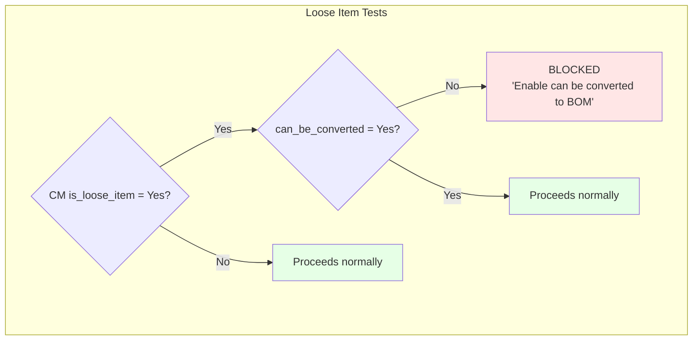

### Test Cases

| # | Test Case | Setup | Expected Result |
|---|-----------|-------|-----------------|
| 5.1 | First upload | No existing CM or BOM | Status: NEW, BOM created |
| 5.2 | Re-upload same | Upload same Excel again | Status: UNCHANGED, no new BOM |
| 5.3 | Changed structure | Modify children in Excel | Status: CHANGED, shows diff |
| 5.4 | Loose item blocked | CM.is_loose_item=1, can_be_converted=0 | Upload blocked with message |
| 5.5 | Loose item enabled | CM.is_loose_item=1, can_be_converted=1 | Proceeds normally |

---

## 6. Procurement Blocking Tests

### Test Flow

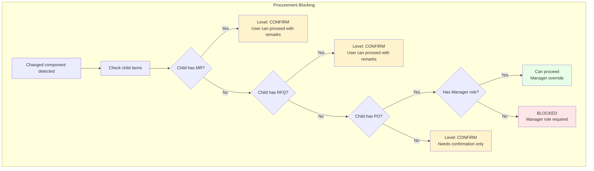

### Test Cases

| # | Test Case | Setup | User Role | Expected Result |
|---|-----------|-------|-----------|-----------------|
| 6.1 | No procurement | Child items have no MR/RFQ/PO | Any | Confirmation required |
| 6.2 | MR exists | Child item has Material Request | Any | Confirmation required |
| 6.3 | RFQ exists | Child item has RFQ | Any | Confirmation required |
| 6.4 | PO - no role | Child item has PO | Regular user | BLOCKED: Manager required |
| 6.5 | PO - with role | Child item has PO | CM Manager | Can proceed with confirmation |

---

## 7. User Confirmation Tests

### Test Flow

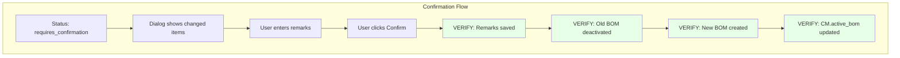

### Test Cases

| # | Test Case | Action | Expected Result |
|---|-----------|--------|-----------------|
| 7.1 | Confirm with remarks | Enter remarks, click Confirm | Remarks saved to CM |
| 7.2 | Old BOM deactivation | After confirmation | Old BOM: is_active=0, is_default=0 |
| 7.3 | New BOM creation | After confirmation | New BOM created & submitted |
| 7.4 | CM linking | After confirmation | CM.active_bom = new BOM name |

---

## 8. BOM Creation & Linking Tests

### Test Flow

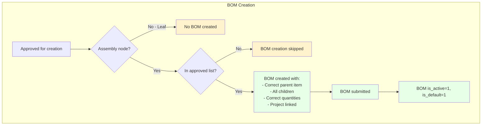

### Test Flow - Hierarchy Codes

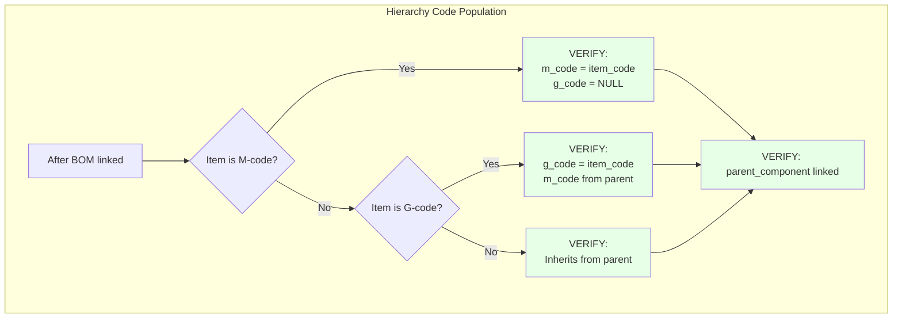

### Test Cases

| # | Test Case | Setup | Expected Result |
|---|-----------|-------|-----------------|
| 8.1 | Leaf item | Item with no children | No BOM created |
| 8.2 | Assembly item | Item with children | BOM created with all children |
| 8.3 | BOM submission | After creation | docstatus=1, is_active=1, is_default=1 |
| 8.4 | CM linking | After BOM submitted | CM.active_bom = BOM name |
| 8.5 | M-code hierarchy | Item starting with M | m_code = item_code |
| 8.6 | G-code hierarchy | Item starting with G | g_code = item_code, m_code from parent |
| 8.7 | BOM Usage | After linking | Component BOM Usage records created |

---

## 9. Output Verification Tests

### Test Flow

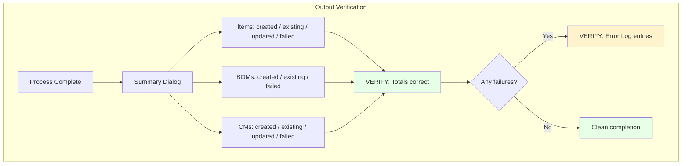

### Test Cases

| # | Test Case | Setup | Expected Result |
|---|-----------|-------|-----------------|
| 9.1 | Summary counts | Complete upload | All counts match actual operations |
| 9.2 | Error logging | Simulate item creation failure | Error logged to Error Log doctype |
| 9.3 | Partial success | Some items fail, others succeed | Failures counted, successes processed |

---

## 10. Complete Test Data Checklist

| # | Test Scenario | Required Test Data | Expected Result |
|---|---------------|-------------------|-----------------|
| 1 | Valid upload - new items | Excel with new item codes, Project, Machine Code | All items, CMs, BOMs created |
| 2 | Re-upload same data | Same Excel uploaded again | Status: UNCHANGED, no new BOMs |
| 3 | Changed BOM structure | Excel with modified children | Status: CHANGED, requires confirmation |
| 4 | Missing Excel column | Excel without 'LivelloBom' header | Validation error with missing column |
| 5 | Loose item blocking | CM with is_loose_item=1, can_be_converted=0 | Upload blocked with message |
| 6 | MR blocking | Child item has Material Request | Confirmation required |
| 7 | PO blocking - no role | Child item has PO, user lacks Manager role | Hard blocked |
| 8 | PO blocking - with role | Child item has PO, user has Manager role | Can proceed with confirmation |
| 9 | T-prefix item | Item code starting with 'T' | released_for_procurement = 'No' |
| 10 | M-prefix item | Item code starting with 'M' | make_or_buy = 'Make' |
| 11 | Level 1 assembly | Root assembly in Excel | project_qty = Excel qty |
| 12 | Level 2+ item | Child item in Excel | project_qty = 0 |

---

## 11. Return Status Quick Reference

| Status | Reason | User Action |
|--------|--------|-------------|
| `success` | - | None - upload complete |
| `blocked` | `loose_items_not_enabled` | Enable 'Can be converted to BOM' on loose items |
| `manager_required` | `active_po_no_role` | Contact Component Master Manager |
| `requires_confirmation` | - | Confirm changes with remarks |

---

## 12. Database Tables to Verify

| Table | Check After |
|-------|-------------|
| Item | Step 2 - Verify items created/updated |
| Project Component Master | Step 3 - Verify CMs with correct prefix rules |
| BOM | Step 6 - Verify BOMs created & submitted |
| BOM Item | Step 6 - Verify children added correctly |
| Component BOM Usage | Step 7 - Verify usage records populated |
