# Project Component Master - Complete Process Flow

## Overview
This diagram shows the complete flow from design data entry through procurement execution to management reporting.

---

## Process Flow Diagram

```mermaid
flowchart TB
    %% ========== STYLING ==========
    classDef entryPoint fill:#e1f5fe,stroke:#01579b,stroke-width:2px
    classDef process fill:#fff3e0,stroke:#e65100,stroke-width:1px
    classDef decision fill:#fce4ec,stroke:#880e4f,stroke-width:2px
    classDef validation fill:#ffebee,stroke:#c62828,stroke-width:2px
    classDef success fill:#e8f5e9,stroke:#2e7d32,stroke-width:2px
    classDef tracking fill:#f3e5f5,stroke:#6a1b9a,stroke-width:1px
    classDef report fill:#e8eaf6,stroke:#283593,stroke-width:2px
    classDef warning fill:#fff8e1,stroke:#f57f17,stroke-width:2px

    %% ========== DATA ENTRY LAYER ==========
    subgraph ENTRY["📥 DATA ENTRY"]
        direction TB
        PE2[("PE2 System<br/>(Design Data)")]:::entryPoint
        EXCEL["Excel Export<br/>~500 components"]:::process

        PE2 --> EXCEL

        subgraph PATHS["Three Entry Paths"]
            direction LR
            PATH1["🆕 BOM Upload<br/>(New Projects)"]:::entryPoint
            PATH2["🔄 Cutover<br/>(Existing Projects)"]:::entryPoint
            PATH3["✋ Manual Entry<br/>(Loose Items)"]:::entryPoint
        end

        EXCEL --> PATH1
    end

    %% ========== COMPONENT MASTER CREATION ==========
    subgraph CM_CREATE["📋 COMPONENT MASTER CREATION"]
        direction TB

        PARSE["Parse Excel<br/>Build BOM Tree"]:::process

        subgraph ITEMS["Create Records for ALL Items"]
            direction LR
            ASM["Assemblies<br/>(M, G, D levels)"]:::process
            RM["Raw Materials<br/>(RM level)"]:::process
        end

        PARSE --> ITEMS

        SET_FIELDS["Set Fields:<br/>• project_qty (from Excel)<br/>• make_or_buy<br/>• created_from"]:::process

        ITEMS --> SET_FIELDS
    end

    %% ========== BOM CREATION & LINKING ==========
    subgraph BOM_LINK["🔗 BOM CREATION & LINKING"]
        direction TB

        CHECK_EXISTING{"Existing BOM<br/>for this item?"}:::decision

        VERSION_CHANGE["⚠️ BOM Version Change<br/>• Remove old BOM usage<br/>• Warn if MR/PO exists<br/>• Update to new version"]:::warning

        CREATE_BOM["Create BOM<br/>(bottom-up)"]:::process

        LINK_BOM["Link to Component Master:<br/>• Set active_bom<br/>• Populate bom_usage<br/>• Calculate bom_qty_required"]:::process

        CHECK_EXISTING -->|"Yes, different"| VERSION_CHANGE
        CHECK_EXISTING -->|"No"| CREATE_BOM
        VERSION_CHANGE --> CREATE_BOM
        CREATE_BOM --> LINK_BOM
    end

    %% ========== MAKE/BUY ROUTING ==========
    subgraph ROUTING["🏭 MAKE/BUY ROUTING"]
        direction TB

        MAKEBUY{"Make or Buy?"}:::decision

        MAKE_PATH["MAKE (In-house)<br/>• Assembly done internally<br/>• Children need separate procurement<br/>• No validation on this item"]:::process

        BUY_PATH["BUY (Procure as unit)<br/>• Ordered from vendor<br/>• Children covered<br/>• Validation enforced"]:::success

        MAKEBUY -->|"Make"| MAKE_PATH
        MAKEBUY -->|"Buy"| BUY_PATH

        CASCADE["🔄 Mid-Project Change?<br/>Cascade recalculation<br/>to all children"]:::warning
    end

    %% ========== AUTO CALCULATIONS ==========
    subgraph CALC["🔢 AUTO CALCULATIONS (on every save)"]
        direction LR

        CALC1["bom_qty_required<br/>= Σ(parent.project_qty × qty_per_unit)<br/>Only for MAKE parents"]:::process

        CALC2["total_qty_limit<br/>= MAX(project_qty, bom_qty_required)"]:::process

        CALC3["procurement_status<br/>Not Started → In Progress → Complete"]:::process

        CALC1 --> CALC2 --> CALC3
    end

    %% ========== PROCUREMENT FLOW ==========
    subgraph PROCUREMENT["📦 PROCUREMENT FLOW"]
        direction TB

        subgraph MR_FLOW["Material Request"]
            MR_CREATE["Create MR"]:::process
            MR_VAL{"Validate:<br/>cumulative qty<br/>≤ total_qty_limit?"}:::validation
            MR_BLOCK["❌ BLOCKED<br/>Shows max allowed"]:::validation
            MR_SAVE["✅ MR Saved"]:::success
            MR_TRACK["Track in CM"]:::tracking

            MR_CREATE --> MR_VAL
            MR_VAL -->|"Exceeds"| MR_BLOCK
            MR_VAL -->|"OK"| MR_SAVE
            MR_SAVE -->|"on_submit"| MR_TRACK
        end

        subgraph RFQ_FLOW["Request for Quotation"]
            RFQ_CREATE["Create RFQ"]:::process
            RFQ_VAL{"Validate:<br/>cumulative qty<br/>≤ total_qty_limit?"}:::validation
            RFQ_BLOCK["❌ BLOCKED"]:::validation
            RFQ_SAVE["✅ RFQ Saved"]:::success
            RFQ_TRACK["Track in CM"]:::tracking

            RFQ_CREATE --> RFQ_VAL
            RFQ_VAL -->|"Exceeds"| RFQ_BLOCK
            RFQ_VAL -->|"OK"| RFQ_SAVE
            RFQ_SAVE -->|"on_submit"| RFQ_TRACK
        end

        subgraph SQ_FLOW["Supplier Quotation"]
            SQ_CREATE["Receive SQ"]:::process
            SQ_COMPARE["Compare Quotes<br/>(separate report)"]:::process

            SQ_CREATE --> SQ_COMPARE
        end

        subgraph PO_FLOW["Purchase Order"]
            PO_CREATE["Create PO"]:::process
            PO_VAL{"Validate:<br/>cumulative qty<br/>≤ total_qty_limit?"}:::validation
            PO_BLOCK["❌ BLOCKED"]:::validation
            PO_SAVE["✅ PO Saved"]:::success
            PO_TRACK["Track in CM"]:::tracking

            PO_CREATE --> PO_VAL
            PO_VAL -->|"Exceeds"| PO_BLOCK
            PO_VAL -->|"OK"| PO_SAVE
            PO_SAVE -->|"on_submit"| PO_TRACK
        end

        subgraph PR_FLOW["Purchase Receipt"]
            PR_CREATE["Receive Goods"]:::process
            PR_TRACK["Track in CM<br/>Update qty received"]:::tracking

            PR_CREATE -->|"on_submit"| PR_TRACK
        end

        MR_TRACK --> RFQ_CREATE
        RFQ_TRACK --> SQ_CREATE
        SQ_COMPARE --> PO_CREATE
        PO_TRACK --> PR_CREATE
    end

    %% ========== LOOSE ITEM CONVERSION ==========
    subgraph LOOSE["🔓 LOOSE ITEM SCENARIO"]
        direction TB

        LOOSE_CREATE["Create Loose Item<br/>(before design finalized)"]:::entryPoint
        LOOSE_PROCURE["Procure early<br/>(long lead time)"]:::process
        LOOSE_CONVERT{"Later added<br/>to BOM?"}:::decision
        LOOSE_STATUS["Status: Converted<br/>• is_loose_item stays Yes<br/>• bom_usage populated<br/>• No duplicate procurement"]:::success

        LOOSE_CREATE --> LOOSE_PROCURE
        LOOSE_PROCURE --> LOOSE_CONVERT
        LOOSE_CONVERT -->|"Yes"| LOOSE_STATUS
    end

    %% ========== REPORTING ==========
    subgraph REPORT["📊 MANAGEMENT REPORTING"]
        direction TB

        REPORT_VIEW["Procurement Status Report<br/>at M & G Level"]:::report

        subgraph DRILL["Drill-Down View"]
            direction LR
            M_LEVEL["Machine (M)<br/>Overall: 65%"]:::report
            G_LEVEL["Sub-Assembly (G)<br/>Procurement: 70%"]:::report
            D_LEVEL["Component (D)<br/>Buy: PO 10/10 ✓<br/>Make: children shown"]:::report
        end

        REPORT_VIEW --> DRILL
        M_LEVEL --> G_LEVEL --> D_LEVEL
    end

    %% ========== CONNECTIONS BETWEEN SECTIONS ==========
    PATH1 --> PARSE
    PATH2 --> SET_FIELDS
    PATH3 --> LOOSE_CREATE

    SET_FIELDS --> CHECK_EXISTING
    LINK_BOM --> MAKEBUY

    MAKE_PATH --> CALC
    BUY_PATH --> CALC
    CASCADE -.-> CALC

    CALC3 --> MR_CREATE

    PR_TRACK --> REPORT_VIEW
    LOOSE_STATUS -.-> CALC
```



---

## Flow Summary

### 1. Data Entry (3 Paths)
| Path | Source | When Used |
|------|--------|-----------|
| **BOM Upload** | PE2 Excel export | New projects, full BOM tree |
| **Cutover** | Existing ERPNext BOMs | Migration of running projects |
| **Manual Entry** | User creates directly | Loose items before design |

### 2. Component Master Creation
- Records created for **ALL items** (assemblies + raw materials)
- Key fields: `project_qty`, `make_or_buy`, `created_from`
- Automatic linking to BOMs via `active_bom` and `bom_usage`

### 3. Make/Buy Routing
| Flag | Meaning | Procurement |
|------|---------|-------------|
| **Make** | Assembled in-house | Children procured separately |
| **Buy** | Procured as unit | Children covered by parent |

**Mid-project changes supported** — cascade recalculation updates all children

### 4. Three-Layer Procurement Validation
```
MR → RFQ → PO
 ↓     ↓     ↓
Validate against total_qty_limit (cumulative check)
```
- **Only "Buy" items validated** (Make items skip)
- **Hard block** if limit exceeded — shows max allowed quantity

### 5. Special Scenarios

#### BOM Version Change
When a new BOM version is submitted:
1. Old BOM's usage entries removed from children
2. Warning if removed items have existing MRs/POs
3. New BOM linked as `active_bom`

#### Loose Item Conversion
1. Item procured before design (long lead time)
2. Later added to BOM via upload
3. `is_loose_item` stays Yes (preserves history)
4. No duplicate procurement (MAX logic prevents)

### 6. Reporting (Pending)
- Tree view starting at Machine (M) level
- Drill-down to Sub-Assembly (G) and Component (D) levels
- **Buy items**: Show direct procurement status
- **Make items**: Show rollup of children's procurement %

---

## Key Business Rules

1. **Quantity Limit**: `total_qty_limit = MAX(project_qty, bom_qty_required)`
2. **Validation Formula**: `existing_qty + new_qty ≤ total_qty_limit`
3. **Procurement Tracking**: MR, RFQ, PO, PR all tracked in Component Master
4. **Make/Buy Impact**: Parent's flag determines if children need separate procurement

---

**Document Version:** 1.0
**Created:** 2026-01-28
**Related:** [clevertech_context.md](../clevertech_context.md) for detailed technical specifications
